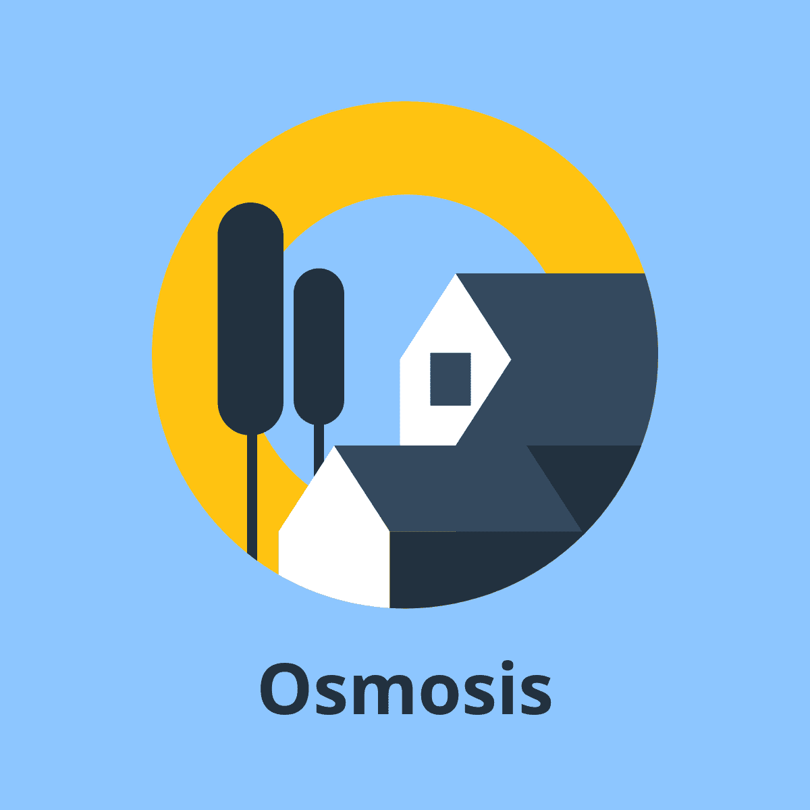

    

# Osmosis Spec

This is the specification for the improved BMTC ticketing system which is to be prototyped at [HackBout](https://www.hackbout.tech/).

## [Installation](docs/installation.md)

## Usage

### Explanation

This explains the idea technically in English with the aid of wireframes. It also states how the prototype will function differently from the real world implementation.

The project is named Osmosis because it helps transport people (biochemically, osmosis is molecules being transported).

We follow a naming strategy similar to major companies such as Uber. The suite of products is called **Osmosis**. The passenger, conductor, and admin's apps are named **Osmosis**, **Osmosis Conductor**, and **Osmosis Admin** respectively. The backend is named **Osmosis Server**.

1. [Product Vision](explanation/product_vision.md)
1. [Objectives](explanation/objectives.md)
1. [Business Viability](explanation/business_viability.md)
1. [Passenger's App](explanation/passengers_app/README.md)
1. [Conductor’s App](explanation/conductors_app/README.md)
1. [Admin's Panel](explanation/admin_panel/README.md)
1. [Database Schema](explanation/db_schema/README.md)
1. [Prototype Deviations](explanation/prototype_deviations.md)

### OpenAPI Specification

The [OpenAPI specification](openapi.yaml) is meant for the prototype. You can view the HTTP API documentation [here](https://neelkamath.gitlab.io/osmosis-spec). While the backend developer is implementing the server, API consumers (e.g., a web frontend developer) can use the [mock server](docs/mock_server.md).

### Branding

Branding assets are in the [`branding` directory](branding).

## [Contributing](docs/CONTRIBUTING.md)

## License

This project is under the [MIT License](LICENSE).
