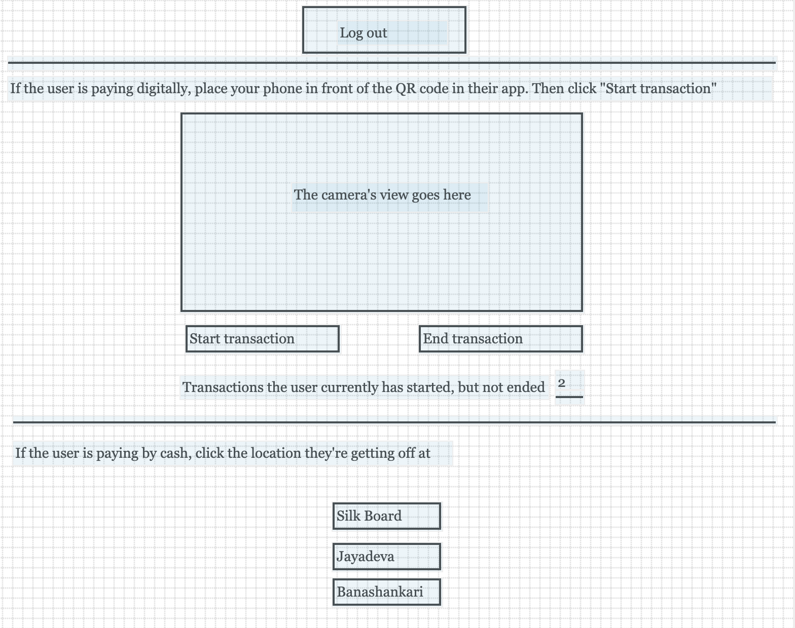

# Conductor’s App

The bus conductors will use a mobile app to ticket passengers. Here’s what the app will do.
- They’ll log in using a username and password.
- Here’s the wireframe.

    
- Passengers using the mobile app will show their QR code to the conductor. When scanned, the number of transactions the user hasn’t ended yet will display. Initially, this will be 0. If the user had a pending transaction on a previous bus which they didn’t end, it will automatically be ended.
- Users who do not end the transaction before leaving the bus are fined automatically 24h after they started their ride, or when they board a different bus and the conductor scans their QR code; whichever comes first. The fine consists of having the user pay for the last stop on the route along with a small amount extra. Since bus routes are circuits, the last stop is considered to be the stop just before the pickup point.
- Clicking “Start transaction” increments the current transaction count. A user may have multiple transactions started at once so as to pay for someone traveling with them (e.g., their child). If the user doesn’t have enough money to pay a possible fine, they won’t be able to transact. It is possible that a mother and child are traveling, and the mother finds out that she only has enough cash for a single transaction after she’s already started her transaction. In this case, the conductor will simply end the transaction, and the family can leave the bus immediately. If a transaction is ended within a minute of it first being started, it will cost no money.
- Upon clicking “End transaction”, every transaction the user currently has open will be ended. It doesn’t make sense to end a single transaction at a time because if the user is paying for someone else, it will be for the same journey. It wouldn’t be possible for the user’s friend to continue traveling after the payer left because they wouldn’t have their phone, and hence QR code, to end the transaction.
- People who don’t have an account (e.g., tourists, people without a smartphone) may pay by cash. At the bottom of the screen, the locations which come next in the bus’s route will display. Upon clicking the location the passenger wants to get off at, a dialog will pop up confirming that the passenger has paid the displayed amount. The dialog consists of the number of tickets to process, the amount that is to be paid, the location the passenger(s) will get off at, a confirmation button, and a cancellation button. Without a receipt, passengers who pay by cash have no proof to forgetful conductors or external auditors that they paid the required fee. The conductor will have to use a portable printer for printing receipts. Cashless users can easily show that they have ongoing transactions by having the conductor scan their QR code and having the auditor check the ticket count on the conductor’s screen.
- The app will automatically log out the conductor if they have lost their job.
