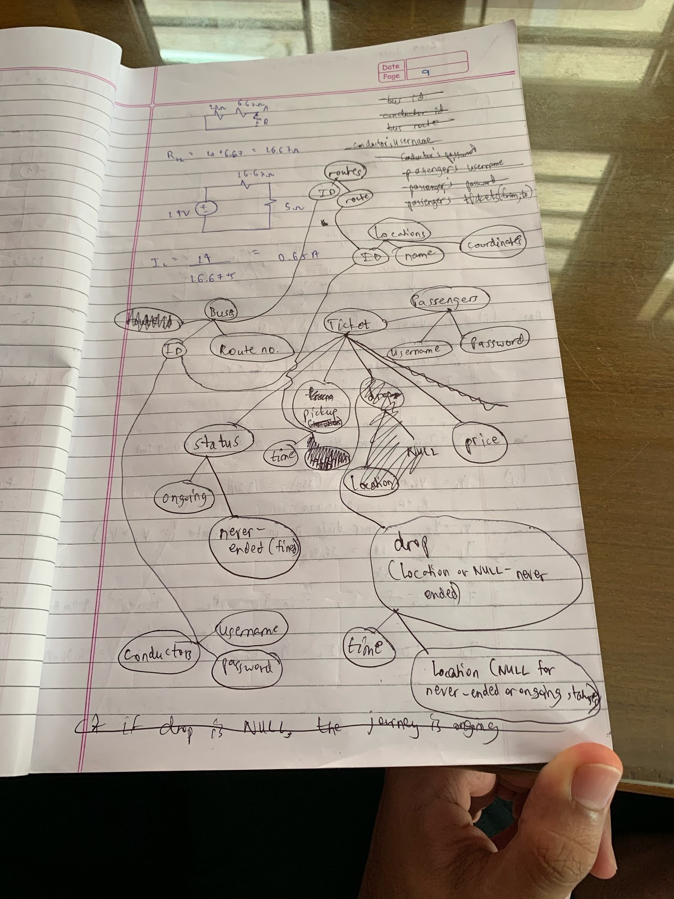

# Database Schema

The routes will also contain how much money each stop costs. Passengers will also have the amount of money in their accounts stored; as well as banking details such as UPI ID, or whatever they use to transact with.