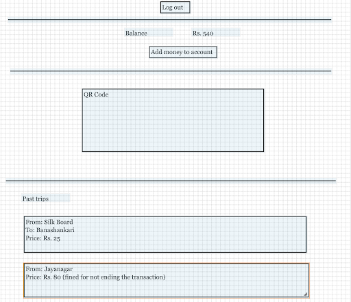

# Passenger's App

Passengers who pay by cash will have no need for this app. Cashless passengers will make use of a mobile app to transact. Here is what the passenger’s app will do.
- Displays past journeys in reverse chronological order. Each journey will detail the pickup location, drop location, money spent, and whether a fine was incurred.
- Top up their account
- Create/delete their account
- QR code to transact
- Wireframe:

    
