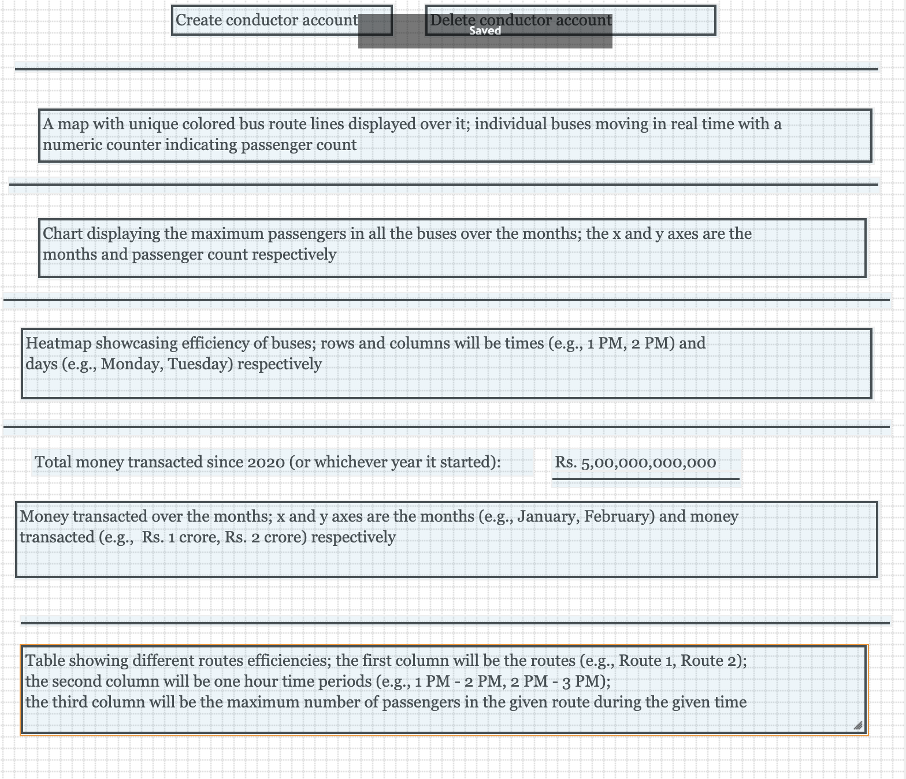

# Admin Panel

The administrator will have a website displaying analytics, and will have the ability to create and delete conductor accounts. The analytics described here are only proposals. Different charts may be added or removed in the actual product. Here are the admin panel’s features.
- Bar chart displaying the maximum number of passengers bus routes took on over the months
- CRUD bus routes
- CRUD conductor accounts
- Heatmap showcasing passenger densities throughout the hours of the days of the week
- A map will display bus movements in real time. Every bus route will have a uniquely colored line on the map. Every route’s individual buses will have a number which indicates the current passenger count.
- Total money transacted, and money transacted over the months
- Wireframe:

    
