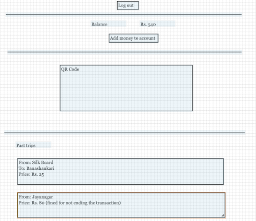
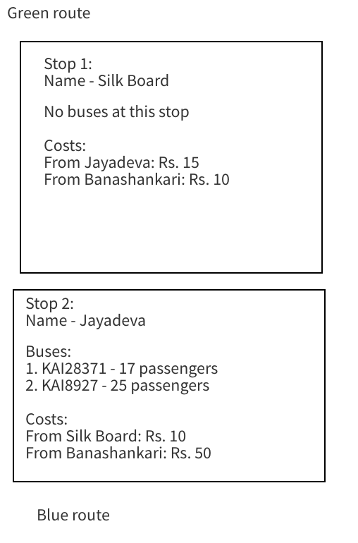

# Passenger's App

Passengers who pay by cash will have no need for this app. Cashless passengers will make use of a mobile app to transact. Here is what the passenger’s app will do.
- Displays past and ongoing journeys in reverse chronological order. Each journey will display the following details.
    - Bus route (e.g., green)
    - Date, time, and location of both pickup and drop locations
    - Number of tickets purchased
    - Whether a fine was incurred
    - Fare paid
- Top up their account
- Create/delete their account
- QR code to transact
- Here's the wireframe for transactions.

    
- Here's the wireframe for bus routes.

    
